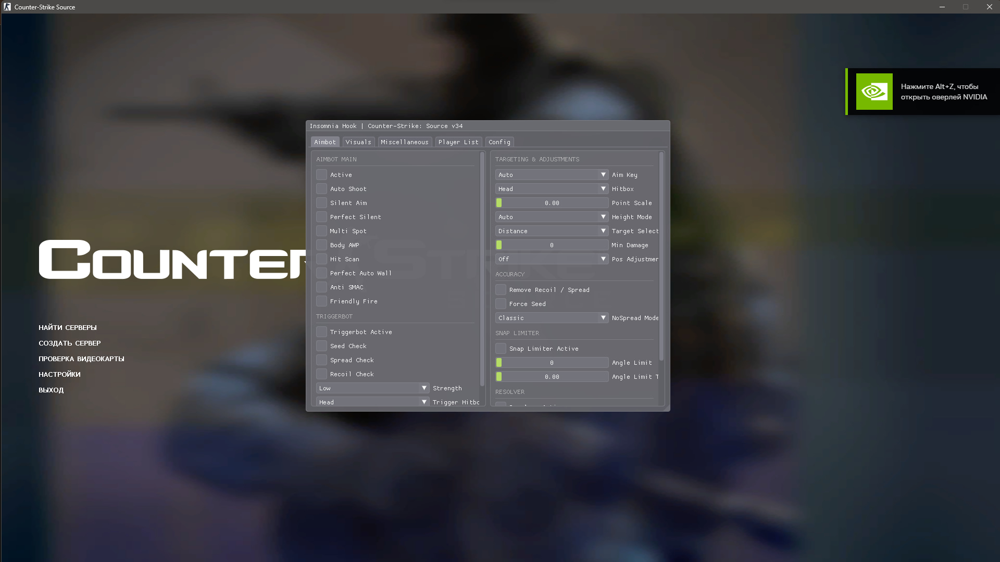

# Insomnia V4 w/ ImGui



🇷🇺: Поговоривши с одним человеком, я принял решение залить исходный код чита Insomnia (v4) с настроеным ImGui. 

Как скомпилировать?
1. Скачайте Visual Studio 22/26.
2. Склонируйте репозиторий через команду ```git clone https://github.com/Av3lure1337/Insomnia-V4-Imgui-Counter-Strike-Source-V34.git```
3. Откройте проект через Visual Studio.
4. В VS нажмите CTRL + Shift + B (или сверху найдите Build и нажмите Build solution)

🇺🇸: After speaking with some people, I decided to upload the source code of the Insomnia (V4) cheat with a configured ImGui.

How to compile?
1. Download Visual Studio 2022/2026.
2. Clone the repository using: ```git clone https://github.com/Av3lure1337/Insomnia-V4-Imgui-Counter-Strike-Source-V34.git``` in terminal
3. Open the project in Visual Studio.
4. In Visual Studio, press Ctrl + Shift + B, or find Build at the top and select Build Solution.

credits:
by [revolveteam](https://t.me/revolveteam) 
